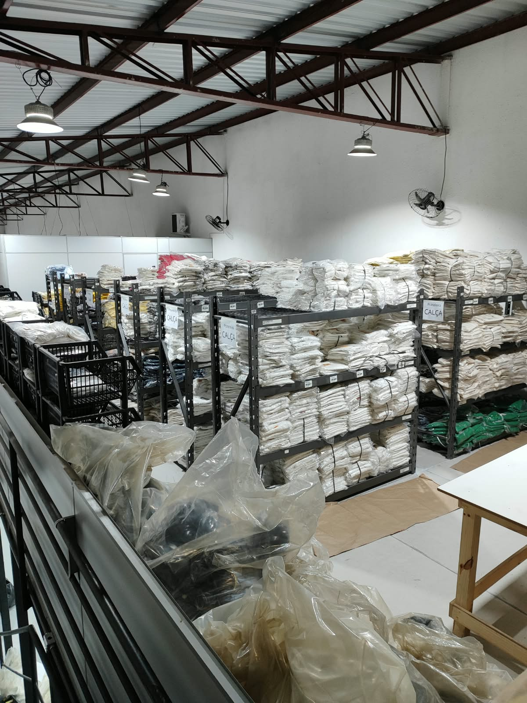
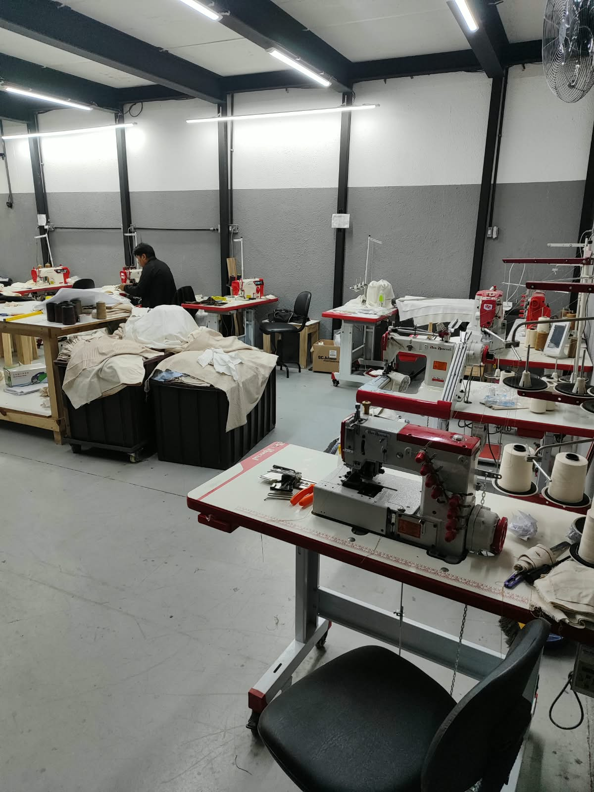
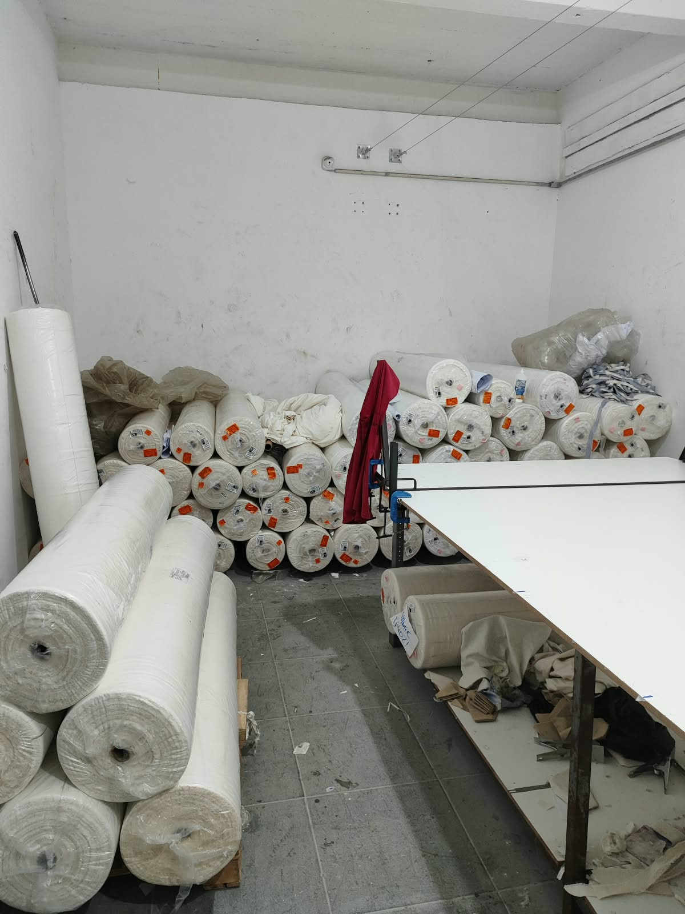
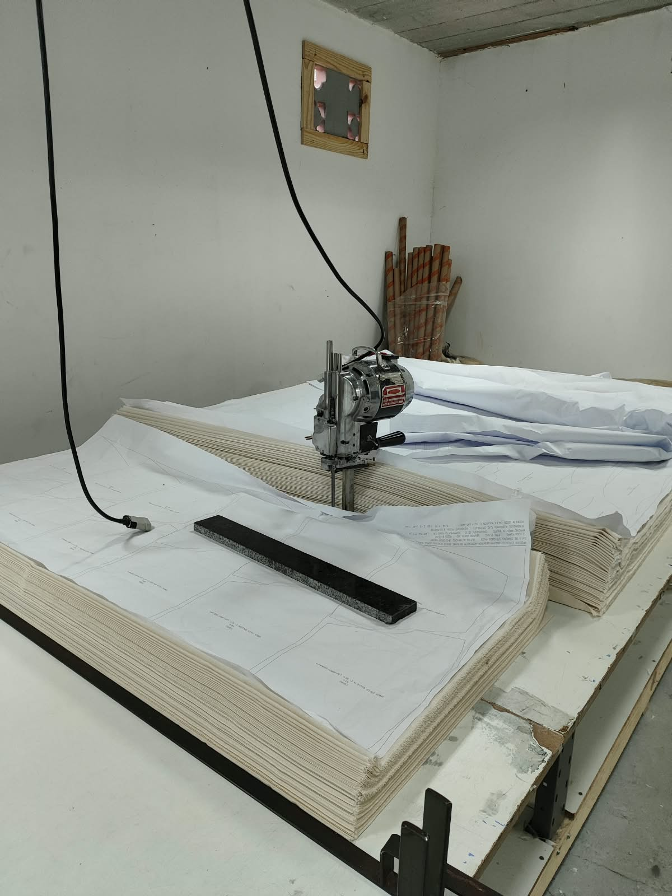
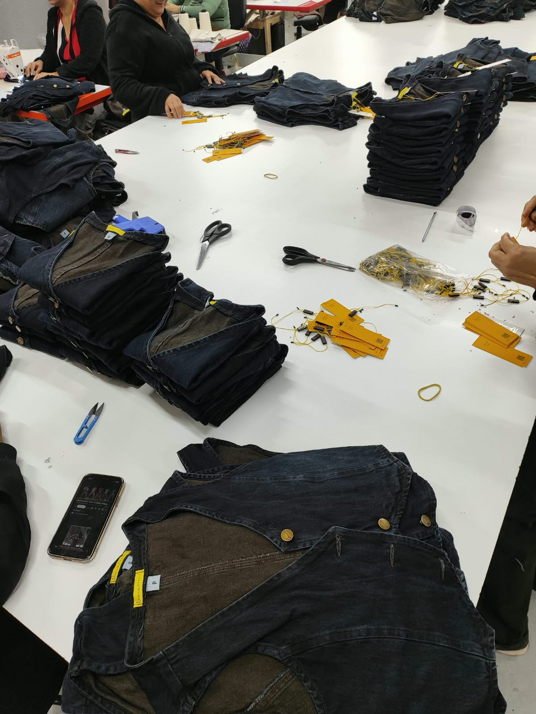
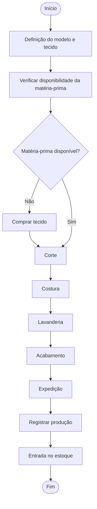
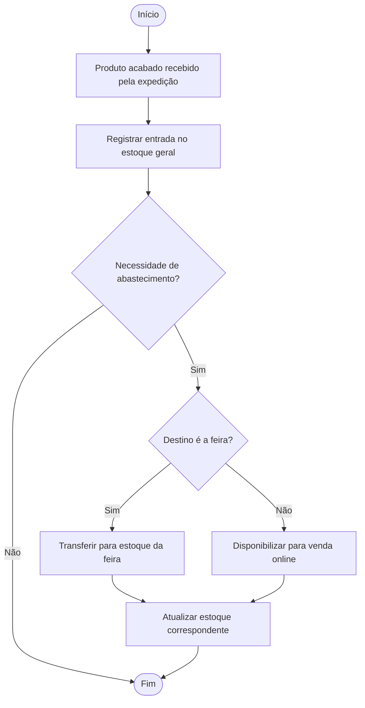
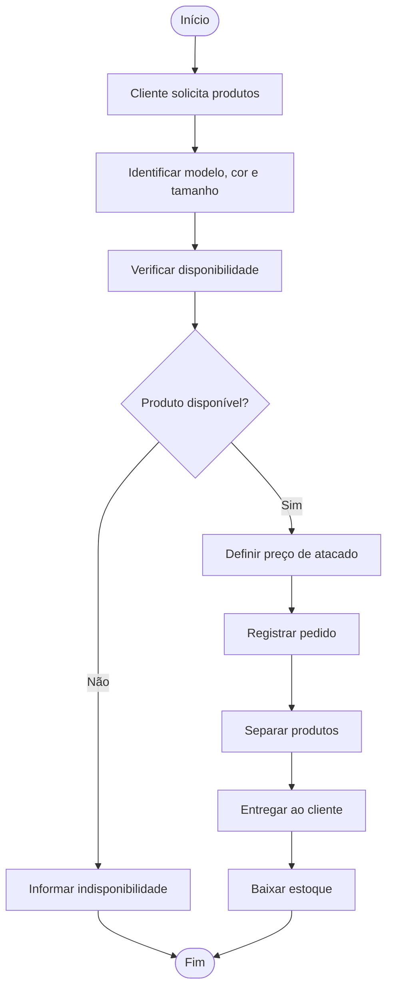
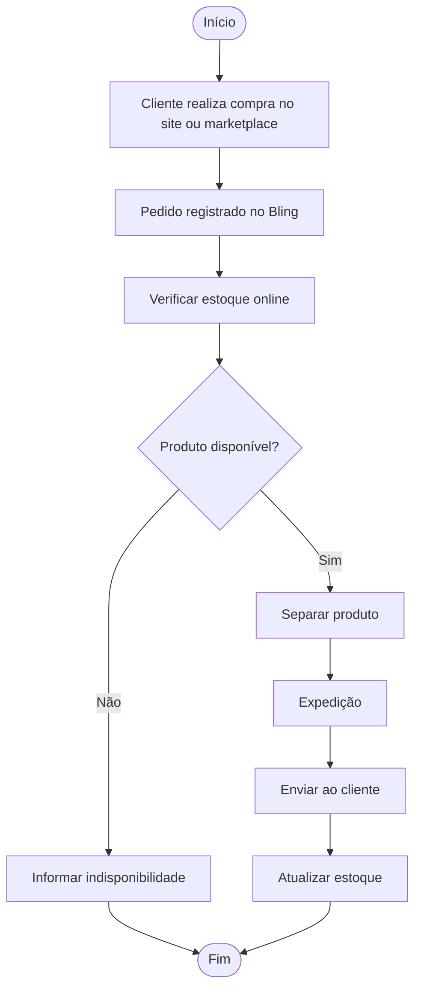
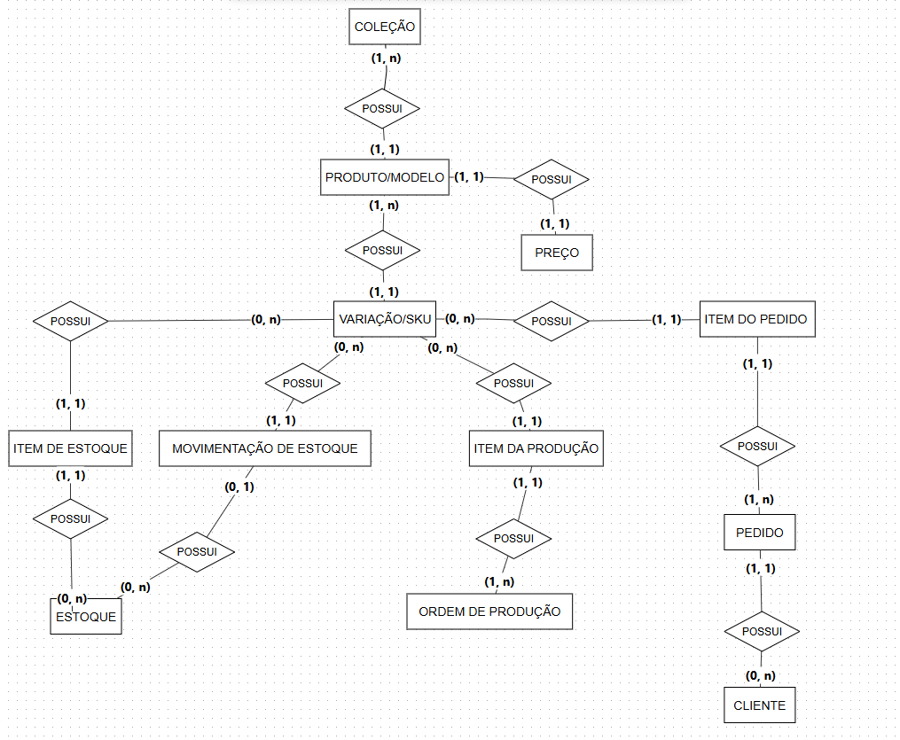

# Entrega 1 — Modelo Conceitual (DER)
### Modelagem de um sistema de gestão de informações para uma organização de pequeno porte

> Este arquivo é o esqueleto do **README.md** do repositório GitHub do seu grupo.
> Preencha cada seção abaixo. Não apague os títulos — apenas substitua as instruções em *itálico* pelo conteúdo do seu projeto.
> O **DER** é anexado separadamente ao repositório (em imagem), mas sua justificativa entra neste README.
>
> **A organização escolhida pode ser de qualquer natureza:** empresa com fins lucrativos (livraria, lanchonete, pet shop), ONG, associação comunitária, cooperativa, instituições religiosas/comunitárias como igrejas, terreiros de religiões de matriz africana (candomblé, umbanda) ou outras. O que muda de um tipo para outro são os processos e as regras específicas — a estrutura do trabalho (levantamento de requisitos, modelagem conceitual, DER) é a mesma para todas. Termos como "empresa" e "negócio" usados abaixo devem ser lidos de forma ampla, no sentido técnico de modelagem de dados (ex.: "regras de negócio" = regras de funcionamento da organização, seja ela comercial, religiosa ou social).
>
> **Importante:** a organização precisa **existir de fato** — não é permitido inventar uma organização fictícia. O levantamento de requisitos e regras de negócio deve ser feito por meio de **pesquisa de campo na própria organização** (visitas, entrevistas com responsáveis, observação dos processos reais), então o grupo só deve escolher uma organização à qual **realmente tenha acesso**. Ao escolher, tomem cuidado com o porte: **nem tão pequena** que não gere dados suficiente para o trabalho (poucos processos, poucas entidades), **nem tão grande/complexa** que fique inviável de modelar nesta primeira etapa do curso.


<!-- Alterar apenas o que tá em italico (o que está entre um único asteristico, ex: *batata doce com abobrinha*. -->

## Metadados

- **Nomes dos alunos e RGM**

| Nome                            | RGM      | 
|---------------------------------|----------|
| Anthony Werick Eloi de França   | 47017228 |
| Gustavo Batista do Canto        | 46898000 |
| Lucas Fortes de Melo            | 46781977 |
| Victor Alves Rodrigues Braulino | 48216305 |
| Vinicius Passos Macedo          | 47116871 |

## 1. Caracterização da Organização
<!-- *(vale 7,5% — Dimensão Conceitual)* -->

- **Nome e natureza da organização:**
  
*A organização escolhida para o desenvolvimento do projeto é a Namiê Brasil Ltda., empresa do segmento de moda feminina, com atuação na fabricação e comercialização de peças de vestuário, especialmente roupas jeans femininas. A empresa possui atuação tanto no comércio atacadista quanto no varejista. Informações públicas cadastrais classificam sua atividade principal como confecção de peças do vestuário, além de atividades de comércio atacadista e varejista de artigos do vestuário.*
  
- **Contexto e porte:**
  
*A Namiê Brasil está localizada no bairro do Brás, em São Paulo – SP, e possui aproximadamente 50 pessoas envolvidas em suas operações. A organização possui diferentes setores, incluindo produção, costura, acabamento, expedição, pontos de venda, e-commerce, financeiro, recursos humanos e diretoria.

A empresa trabalha com fabricação própria de roupas femininas e comercializa seus produtos em diferentes canais. No atacado, as vendas ocorrem presencialmente nos pontos de venda e também por meio do WhatsApp, tendo como público principal as revendedoras. No varejo, as vendas são realizadas por meio do site e de marketplaces, atendendo diretamente consumidores finais.

O processo produtivo envolve a definição do modelo e do tecido, aquisição de matéria-prima quando necessária, corte, costura, lavanderia e acabamento. O acabamento compreende atividades como aplicação de botões, etiquetas, tags e demais aviamentos. Todas as etapas do processo produtivo são realizadas internamente pela própria fábrica.*

- **Problemas e necessidades identificados:**
  
*Durante o levantamento realizado com a organização, foi identificada uma fragmentação no controle das informações de estoque e vendas, que atualmente são distribuídas entre diferentes ferramentas.

O controle de matérias-primas, cortes, costura, acabamento e determinadas movimentações é realizado por meio do sistema Omiê. O controle dos estoques de produtos acabados, incluindo o estoque geral e o estoque destinado à feira, é realizado por meio de planilhas eletrônicas. Já as vendas realizadas pelo site e marketplaces são controladas pelo sistema Bling ERP, que também mantém o estoque destinado às vendas online.

Essa divisão faz com que as informações de estoque não estejam centralizadas em um único sistema. Além disso, as planilhas não são atualizadas necessariamente no momento em que ocorre uma movimentação, podendo ocorrer divergências entre o estoque registrado e a quantidade efetivamente disponível.

Também foi identificado que, em determinadas situações, uma peça pode ser vendida sem que sua disponibilidade seja previamente confirmada, ocasionando a venda de produtos que não estão disponíveis em estoque. Nas vendas realizadas na feira, a baixa das peças pode ocorrer imediatamente ou posteriormente, contribuindo para a possibilidade de divergências no controle.

Outro ponto identificado é a ausência de um estoque mínimo definido, fazendo com que a necessidade de produção ou reposição seja percebida principalmente quando a quantidade disponível se torna insuficiente ou se esgota.*

- **Justificativa da escolha:**
  
*A Namiê Brasil foi escolhida por apresentar uma operação real que envolve diferentes processos relacionados à produção, controle de estoque e comercialização de produtos, proporcionando quantidade e variedade suficientes de informações para a realização da modelagem conceitual.

Além disso, um dos integrantes do grupo possui acesso à organização, permitindo o levantamento de requisitos diretamente com base nos processos reais observados. A existência de diferentes ferramentas utilizadas simultaneamente para controle das operações também proporciona um problema concreto para análise e modelagem de uma possível solução integrada.

O controle de produtos acabados apresenta ainda diferentes características que precisam ser consideradas pelo sistema, como modelo, coleção, cor, tamanho e SKU, além da existência de diferentes locais de estoque e canais de venda.*

- **Evidências da organização:**









*Namiê Brasil possui presença pública na internet por meio de seu site oficial:*

https://www.namiebrasil.com.br/

*E pelo instagram:*

https://www.instagram.com/namiebrasil/


*A empresa está localizada no bairro do Brás, em São Paulo – SP. Informações públicas de cadastro empresarial indicam a sede na Rua Piratininga, 514, conjunto 500, Brás, São Paulo – SP, CEP 03042-000.
Porém, possui 3 lojas físicas.

As demais evidências referentes ao acesso do grupo à organização, como registros da pesquisa de campo, fotografias e identificação do responsável que forneceu as informações, serão anexadas ou apresentadas conforme a documentação disponível ao grupo.*

---

## 2. Processos de Negócio
<!-- *(vale 10% — Dimensão Procedimental)* -->

- **Principais processos mapeados:**
  
*A produção inicia-se com a definição do modelo e do tecido pela diretoria. Após verificar a disponibilidade da matéria-prima, o tecido é adquirido quando necessário. Em seguida, o material passa pelas etapas de corte, costura, lavanderia e acabamento, todas realizadas pela própria fábrica. No acabamento são aplicados itens como botões, etiquetas, tags e demais aviamentos. Após a conclusão, as peças são encaminhadas à expedição, que registra a produção e realiza a entrada dos produtos acabados no estoque.*
  
*Após a conclusão da produção, os produtos acabados são encaminhados à expedição, que registra sua entrada no estoque. O estoque geral é utilizado como principal estoque de produtos acabados e pode abastecer o estoque destinado à feira. Quando necessário, ocorre uma transferência do estoque geral para o estoque da feira, atualmente realizada por meio de planilhas.
O estoque destinado às vendas online é controlado separadamente pelo Bling ERP. Dessa forma, os estoques geral, feira e online possuem controles distintos.
Peças que apresentam defeitos, são perdidas, utilizadas como amostras ou retornam da feira são destinadas ao “defeitão”, não sendo consideradas no estoque normal. Já devoluções de vendas online que retornam sem danos podem voltar ao estoque online por meio do processo automatizado do Bling.*

*As vendas no atacado são realizadas presencialmente nos pontos de venda, principalmente na Feira da Madrugada, ou de forma online por meio do WhatsApp. O público principal é composto por revendedoras e outros clientes que adquirem produtos para revenda, embora também possam ocorrer vendas para consumidores finais.
O cliente informa os produtos desejados, identificados principalmente por modelo, cor e tamanho. Após a definição dos produtos e quantidades, é aplicado o preço de atacado e o pedido é realizado.
Atualmente, os pedidos de atacado não possuem o mesmo nível de estruturação das vendas online. As informações são tratadas principalmente por meio do atendimento e dos controles internos da empresa.
Após a venda, os produtos são separados e o estoque correspondente é atualizado. Na feira, essa baixa pode ocorrer imediatamente ou posteriormente, o que pode contribuir para divergências entre o estoque registrado e o estoque físico.*

*As vendas no varejo são realizadas por meio do site da empresa e de marketplaces. Quando o cliente realiza uma compra, o pedido é registrado no Bling ERP, que também realiza o controle do estoque destinado às vendas online.
O produto é identificado de forma mais precisa por meio do SKU ou EAN-13. Após o registro do pedido, o produto disponível é separado para expedição e posteriormente enviado ao cliente.
O estoque online é controlado separadamente dos demais estoques. Em caso de devolução de uma peça sem danos, o produto pode retornar ao estoque online, com a entrada sendo realizada automaticamente pelo Bling.*

  
- **Fluxogramas:** 
### 2.1 Produção de peças




### 2.2 Abastecimento e movimentação de estoque



### 2.3 Venda no atacado



### 2.4 Venda no varejo


---
## 3. Requisitos do Sistema
<!-- *(esta seção e a Seção 4 "Regras de Negócio" DIVIDEM 7,5% na dimensão conceitual — juntas valem 7,5%, não 7,5% cada — + 4% exclusivos desta seção na organização/documentação)* -->

### 3.1 Requisitos Funcionais
<!-- *O que o sistema precisa FAZER (ex.: "o sistema deve permitir registrar uma venda").* -->
| ID       | Requisito                                                                                           |
| -------- | --------------------------------------------------------------------------------------------------- |
| **RF01** | O sistema deve permitir cadastrar e consultar produtos/modelos.                                     |
| **RF02** | O sistema deve permitir cadastrar as variações de um produto, considerando cor, tamanho e SKU.      |
| **RF03** | O sistema deve permitir cadastrar e associar produtos às suas respectivas coleções.                 |
| **RF04** | O sistema deve permitir cadastrar clientes e seus dados necessários para realização de pedidos.     |
| **RF05** | O sistema deve permitir registrar pedidos de venda no atacado.                                      |
| **RF06** | O sistema deve permitir registrar pedidos de venda no varejo.                                       |
| **RF07** | O sistema deve permitir adicionar produtos, quantidades e preços aos pedidos.                       |
| **RF08** | O sistema deve permitir consultar a disponibilidade de produtos em cada local de estoque.           |
| **RF09** | O sistema deve permitir registrar entradas e saídas de produtos do estoque.                         |
| **RF10** | O sistema deve permitir registrar transferências de produtos entre estoques.                        |
| **RF11** | O sistema deve permitir registrar produtos destinados ao estoque de itens defeituosos (“defeitão”). |
| **RF12** | O sistema deve permitir registrar ordens de produção e suas respectivas quantidades produzidas.     |
| **RF13** | O sistema deve permitir associar as quantidades produzidas às respectivas variações/SKUs.           |
| **RF14** | O sistema deve permitir registrar a entrada de produtos acabados no estoque após a produção.        |
| **RF15** | O sistema deve permitir consultar o histórico de movimentações de estoque.                          |
| **RF16** | O sistema deve permitir consultar os pedidos de venda realizados.                                   |
| **RF17** | O sistema deve permitir diferenciar os preços praticados no atacado e no varejo.                    |
| **RF18** | O sistema deve permitir identificar o canal de venda associado a cada pedido.                       |

### 3.2 Requisitos Não Funcionais
<!-- *Características de qualidade (ex.: desempenho, segurança, usabilidade, disponibilidade).* -->
| ID        | Requisito                                                                                                                                        |
| --------- | ------------------------------------------------------------------------------------------------------------------------------------------------ |
| **RNF01** | O sistema deve possuir interface simples e intuitiva, permitindo que os funcionários realizem as operações sem conhecimentos técnicos avançados. |
| **RNF02** | Os dados armazenados devem possuir mecanismos de proteção contra acesso não autorizado.                                                          |
| **RNF03** | O sistema deve manter registro das movimentações realizadas, permitindo identificar alterações de estoque e pedidos.                             |
| **RNF04** | As consultas de produtos e estoques devem apresentar os resultados em tempo adequado para utilização durante as operações da empresa.            |
| **RNF05** | O sistema deve possuir mecanismo de backup periódico dos dados armazenados.                                                                      |
| **RNF06** | O sistema deve preservar a integridade dos dados, evitando registros inconsistentes de produtos, pedidos e estoques.                             |
| **RNF07** | O sistema deve permitir utilização simultânea por diferentes usuários autorizados.                                                               |
                                                            


---

## 4. Regras de Negócio
*(esta seção DIVIDE com a Seção 3 "Requisitos do Sistema" os mesmos 7,5% da dimensão conceitual — juntas valem 7,5%, não 7,5% cada — + 4% exclusivos desta seção na documentação. "Regras de negócio" é o termo técnico usado em modelagem de dados para as regras de funcionamento de qualquer organização, com ou sem fins lucrativos)*
- **Regras operacionais:**
*condições que a organização impõe (ex.: "um pedido só pode ser fechado se houver estoque disponível", "uma doação só pode ser registrada com identificação do doador", "um ritual só pode ser agendado se o espaço estiver disponível").*
  
RN01 — Identificação de produtos
Cada produto deve ser identificado por um modelo, uma cor e um tamanho, formando uma variação específica com seu respectivo SKU.

RN02 — Associação entre produto e coleção
Um produto pode estar associado a uma coleção, sendo que a coleção é determinada de acordo com a cor utilizada no produto

RN03 — Controle de estoque por localização
Os produtos acabados devem possuir controle de estoque separado de acordo com sua localização ou finalidade: estoque geral, estoque da feira e estoque online.

RN04 — Transferência para a feira
Quando houver necessidade de abastecimento da feira, os produtos devem ser transferidos do estoque geral para o estoque da feira, reduzindo a quantidade disponível no estoque de origem e aumentando a quantidade no estoque de destino.

RN05 — Disponibilidade para venda
Um produto somente deve ser disponibilizado para venda quando houver quantidade disponível no estoque correspondente ao canal de venda.

RN06 — Diferenciação de preços
O preço de venda de um produto deve considerar o tipo de venda, diferenciando os valores praticados no atacado e no varejo.

RN07 — Composição do pedido
Um pedido deve possuir um cliente e ser composto por um ou mais itens, sendo cada item relacionado a uma variação específica de produto e sua respectiva quantidade.

RN08 — Registro de produção
Toda produção de produtos acabados deve ser registrada, informando as variações produzidas e suas respectivas quantidades.

RN09 — Entrada de produtos acabados
Após a conclusão da produção e o recebimento pela expedição, os produtos acabados devem ser registrados como entrada no estoque geral.

RN10 — Produtos com defeito
Produtos considerados defeituosos, perdidos, devolvidos com problema ou utilizados como amostras devem ser direcionados ao estoque denominado “defeitão” e não devem compor o estoque normal disponível para venda.

RN11 — Devoluções do e-commerce
Produtos devolvidos por clientes de vendas online que estejam em condições adequadas para comercialização devem retornar ao estoque online.
  
- **Restrições organizacionais:**
*limitações que afetam o modelo (ex.: políticas internas, prazos, exigências legais, normas religiosas ou estatutárias) — e por que elas importam.*

RO01 — Estoques separados por canal
Os estoques geral, da feira e online são mantidos separadamente pela organização. Essa característica deve ser considerada no modelo para permitir o controle individual das quantidades disponíveis em cada local.

RO02 — Diferentes sistemas utilizados pela organização
A organização utiliza ferramentas distintas para diferentes operações: Omiê para processos relacionados à matéria-prima e produção, planilhas eletrônicas para determinados controles de produtos acabados e estoques, e Bling ERP para as vendas online. Essa fragmentação justifica a necessidade de um modelo que centralize as informações relevantes para os processos analisados.

RO03 — Produção própria
As etapas de corte, costura, lavanderia e acabamento são realizadas internamente pela própria fábrica. O modelo deve, portanto, representar a produção como um processo interno da organização.

---

## 5. Dicionário de Dados Conceitual (Preliminar)
<!-- *(vale 10% — Dimensão Procedimental)* -->
Para cada entidade identificada, liste:

| Atributo | Descrição | Regra de negócio associada |
|----------|-----------|------------------------------|
| *nome do atributo* | *o que ele representa* | *se houver alguma regra (obrigatoriedade, valores possíveis, etc.)* |

*Mantenha o dicionário organizado e padronizado (mesmo formato de tabela para todas as entidades).*

**Atenção à privacidade:** se forem usados exemplos de valores para ilustrar os atributos, esses exemplos devem ser **fictícios** — não utilize dados reais de clientes, fiéis, beneficiários, doadores ou funcionários da organização (nomes, CPFs, contatos etc.), mesmo que tenham sido observados durante a pesquisa de campo. Os exemplos devem apenas ser **coerentes com as operações reais** observadas.

**COLEÇÃO**
| Atributo   | Descrição                | Regra de negócio associada                  |
| ---------- | ------------------------ | ------------------------------------------- |
| id_colecao | Identificador da coleção | Deve identificar unicamente cada coleção    |
| nome       | Nome da coleção          | Deve permitir identificar a coleção         |
| tipo       | Classificação da coleção | Pode representar coleção normal ou especial |

**PRODUTO/MODELO**
| Atributo   | Descrição                            | Regra de negócio associada                   |
| ---------- | ------------------------------------ | -------------------------------------------- |
| id_produto | Identificador do modelo do produto   | Deve identificar unicamente cada modelo      |
| nome       | Nome do modelo do produto            | Obrigatório                                  |
| descricao  | Descrição do modelo                  | Pode ser utilizada para detalhar o produto   |
| id_colecao | Identificação da coleção relacionada | O produto deve estar associado a uma coleção |

**VARIAÇÃO/SKU**
| Atributo    | Descrição                           | Regra de negócio associada                                        |
| ----------- | ----------------------------------- | ----------------------------------------------------------------- |
| id_variacao | Identificador da variação           | Deve identificar unicamente a variação                            |
| sku         | Código de identificação da variação | Cada combinação de modelo, cor e tamanho possui um SKU específico |
| cor         | Cor da peça                         | Obrigatória                                                       |
| tamanho     | Tamanho da peça                     | Obrigatório                                                       |
| id_produto  | Produto/modelo ao qual pertence     | Toda variação deve pertencer a um modelo                          |

**PREÇO**
PREÇO

| Atributo      | Descrição                             | Regra de negócio associada                                      |
| ------------- | ------------------------------------- | --------------------------------------------------------------- |
| id_preco      | Identificador do preço                | Deve identificar unicamente o registro de preço                 |
| preco_atacado | Preço praticado nas vendas de atacado | Deve representar o valor utilizado para vendas de atacado       |
| preco_varejo  | Preço praticado nas vendas de varejo  | Deve representar o valor utilizado para vendas de varejo        |
| id_produto    | Modelo relacionado                    | Cada registro de preço deve estar associado a um produto/modelo |


**ESTOQUE**
| Atributo    | Descrição                      | Regra de negócio associada                                           |
| ----------- | ------------------------------ | -------------------------------------------------------------------- |
| id_estoque  | Identificador do estoque       | Deve identificar unicamente cada estoque                             |
| localização | Local ou finalidade do estoque | Deve diferenciar, no mínimo, geral, feira, online e defeitão         |

**ITEM DE ESTOQUE**
| Atributo        | Descrição                                         | Regra de negócio associada                                 |
| --------------- | ------------------------------------------------- | ---------------------------------------------------------- |
| id_item_estoque | Identificador do registro de estoque              | Deve identificar unicamente o registro                     |
| quantidade      | Quantidade disponível da variação naquele estoque | Deve ser maior ou igual a zero                             |
| id_estoque      | Estoque relacionado                               | Todo item de estoque deve pertencer a um estoque           |
| id_variacao     | Variação/SKU armazenada                           | Todo item de estoque deve estar relacionado a uma variação |

**MOVIMENTAÇÃO DE ESTOQUE**
| Atributo           | Descrição                          | Regra de negócio associada                                                   |
| ------------------ | ---------------------------------- | ---------------------------------------------------------------------------- |
| id_movimentacao    | Identificador da movimentação      | Deve identificar unicamente cada movimentação                                |
| tipo               | Tipo da movimentação               | Deve indicar entrada, saída ou transferência                                 |
| quantidade         | Quantidade movimentada             | Deve ser maior que zero                                                      |
| data_hora          | Data e horário da movimentação     | Deve registrar quando a movimentação ocorreu                                 |
| id_estoque_origem  | Estoque de origem da movimentação  | Deve referenciar o estoque de origem quando houver saída ou transferência    |
| id_estoque_destino | Estoque de destino da movimentação | Deve referenciar o estoque de destino quando houver entrada ou transferência |
| id_variacao        | Variação movimentada               | Toda movimentação deve estar relacionada a uma variação/SKU                  |

**ORDEM DE PRODUÇÃO**
| Atributo    | Descrição                          | Regra de negócio associada                          |
| ----------- | ---------------------------------- | --------------------------------------------------- |
| id_ordem    | Identificador da ordem de produção | Deve identificar unicamente cada ordem              |
| data_inicio | Data de início da produção         | Registra o início da ordem                          |
| data_fim    | Data de conclusão da produção      | Deve ser preenchida quando a produção for concluída |
| status      | Situação da ordem                  | Deve representar a situação atual da produção       |

**ITEM DA PRODUÇÃO**
| Atributo         | Descrição                         | Regra de negócio associada                                          |
| ---------------- | --------------------------------- | ------------------------------------------------------------------- |
| id_item_producao | Identificador do item da produção | Deve identificar unicamente o item                                  |
| quantidade       | Quantidade produzida              | Deve ser maior que zero                                             |
| id_ordem         | Ordem de produção relacionada     | Todo item deve pertencer a uma ordem de produção                    |
| id_variacao      | Variação produzida                | Permite registrar diferentes tamanhos, cores ou SKUs na mesma ordem |

**CLIENTE**
| Atributo   | Descrição                | Regra de negócio associada                                         |
| ---------- | ------------------------ | ------------------------------------------------------------------ |
| id_cliente | Identificador do cliente | Deve identificar unicamente cada cliente                           |
| nome       | Nome do cliente          | Obrigatório                                                        |
| tipo       | Tipo de cliente          | Deve diferenciar, no mínimo, revendedor/empresa e consumidor final |

**PEDIDO**
| Atributo   | Descrição                | Regra de negócio associada                    |
| ---------- | ------------------------ | --------------------------------------------- |
| id_pedido  | Identificador do pedido  | Deve identificar unicamente cada pedido       |
| data_hora  | Data e horário do pedido | Registra quando o pedido foi realizado        |
| canal      | Canal de venda           | Deve diferenciar atacado e varejo             |
| id_cliente | Cliente relacionado      | Todo pedido deve estar associado a um cliente |

**ITEM DO PEDIDO**
| Atributo       | Descrição               | Regra de negócio associada                          |
| -------------- | ----------------------- | --------------------------------------------------- |
| id_item_pedido | Identificador do item   | Deve identificar unicamente o item                  |
| quantidade     | Quantidade solicitada   | Deve ser maior que zero                             |
| preco_unitario | Preço unitário aplicado | Deve considerar o tipo de venda                     |
| id_pedido      | Pedido relacionado      | Todo item deve pertencer a um pedido                |
| id_variacao    | Variação comercializada | Cada item deve estar relacionado a uma variação/SKU |


---

## 6. Modelagem Conceitual (Entidades, Atributos, Relacionamentos)
<!-- *(vale 7,5% na dimensão conceitual)* -->
- **Entidades reconhecidas:** *liste e justifique brevemente cada uma.*
- **Atributos e classificações:** *quais atributos pertencem a cada entidade.*
- **Relacionamentos pertinentes:** *como as entidades se conectam.*
- **Restrições e políticas organizacionais aplicadas ao modelo.**

## 6. Modelagem Conceitual (Entidades, Atributos, Relacionamentos)

O modelo conceitual proposto para a Namiê Brasil representa os principais dados envolvidos nos processos de produção, controle de estoque e comercialização de produtos.

## 6.1 Entidades e relacionamentos

**COLEÇÃO ↔ PRODUTO/MODELO**

Uma coleção pode possuir um ou vários produtos/modelos.

Cada produto/modelo pertence obrigatoriamente a uma única coleção.

Essa relação representa a organização dos modelos de produtos dentro das coleções utilizadas pela empresa.

**PRODUTO/MODELO ↔ VARIAÇÃO/SKU**

Um produto/modelo pode possuir uma ou várias variações.

Cada variação/SKU pertence a um único produto/modelo.

A variação representa uma combinação específica de cor e tamanho e possui um SKU próprio para sua identificação.

Exemplo:

> Produto: Cropped Faixa Elástico
> ├── Off White / P
> ├── Off White / M
> └── Off White / G

Essa estrutura permite representar diferentes variações de um mesmo modelo sem duplicar as informações gerais do produto.

**PRODUTO/MODELO ↔ PREÇO**

Cada produto/modelo possui um único registro de preço.

Cada registro de preço está relacionado a um único produto/modelo.

A entidade PREÇO armazena os valores praticados nas vendas de atacado e varejo, permitindo diferenciar os preços de acordo com o tipo de venda.

## 6.2 Produtos e estoques

**VARIAÇÃO/SKU ↔ ITEM DE ESTOQUE**

Uma variação/SKU pode possuir nenhum ou vários registros de item de estoque.

Cada item de estoque está relacionado a uma única variação/SKU.

Essa estrutura permite que uma mesma variação seja armazenada em diferentes estoques, mantendo registros independentes para cada local.

**ITEM DE ESTOQUE ↔ ESTOQUE**

Cada item de estoque pertence a um único estoque.

Um estoque pode possuir nenhum ou vários itens de estoque.

Os estoques considerados no modelo são:

* Geral
* Feira
* Online
* Defeitão

Exemplo:

> SKU X → Estoque Geral → 20 unidades
> SKU X → Estoque Feira → 5 unidades

Dessa forma, a quantidade de uma mesma variação pode ser controlada separadamente em diferentes estoques.

## 6.3 Movimentação de estoque

**VARIAÇÃO/SKU ↔ MOVIMENTAÇÃO DE ESTOQUE**

Uma variação/SKU pode participar de nenhuma ou várias movimentações de estoque.

Cada movimentação de estoque está relacionada a uma única variação/SKU.

A movimentação registra informações como tipo, quantidade e data e horário da operação.

**MOVIMENTAÇÃO DE ESTOQUE ↔ ESTOQUE**

Uma movimentação pode estar relacionada a nenhum ou um estoque.

Um estoque pode estar relacionado a nenhuma ou várias movimentações.

A relação permite registrar as alterações realizadas nos estoques, considerando a movimentação de produtos.

As movimentações podem representar:

* Entrada de produtos;
* Saída de produtos;
* Transferência de produtos entre estoques.

Exemplo:

> 20 unidades do SKU X | Estoque Geral → Estoque Feira

Nesse caso, a movimentação registra a alteração da quantidade do SKU X relacionada ao estoque.

## 6.4 Produção

**VARIAÇÃO/SKU ↔ ITEM DA PRODUÇÃO**

Uma variação/SKU pode aparecer em nenhum ou vários itens de produção.

Cada item da produção corresponde a uma única variação/SKU.

O item da produção registra a quantidade produzida daquela variação.

**ITEM DA PRODUÇÃO ↔ ORDEM DE PRODUÇÃO**

Cada item da produção pertence a uma única ordem de produção.

Uma ordem de produção possui um ou vários itens de produção.

Essa estrutura permite que uma mesma ordem de produção registre diferentes variações/SKUs e suas respectivas quantidades.

Portanto:

> ORDEM DE PRODUÇÃO → ITEM DA PRODUÇÃO → VARIAÇÃO/SKU

## 6.5 Clientes e pedidos

**VARIAÇÃO/SKU ↔ ITEM DO PEDIDO**

Uma variação/SKU pode aparecer em nenhum ou vários itens de pedidos.

Cada item do pedido corresponde a uma única variação/SKU.

Essa relação permite registrar quais produtos foram comercializados em cada pedido.

**ITEM DO PEDIDO ↔ PEDIDO**

Cada item do pedido pertence a um único pedido.

Um pedido possui um ou vários itens do pedido.

Cada item registra a quantidade e o preço unitário aplicado na venda.

Dessa forma, o pedido pode conter diferentes produtos e quantidades.

**PEDIDO ↔ CLIENTE**

Cada pedido pertence a um único cliente.

Um cliente pode possuir nenhum ou vários pedidos.

Essa relação permite manter o histórico de compras de cada cliente e associar cada pedido ao respectivo comprador.

Assim:

> CLIENTE → PEDIDO → ITEM DO PEDIDO → VARIAÇÃO/SKU

Exemplo:

> Cliente X
> Pedido 001
> ├── 5 × Calça modelo A / 38
> ├── 3 × Calça modelo A / 40
> └── 2 × Cropped modelo B / M

## 6.6 Estrutura conceitual

A estrutura apresentada no DER relaciona as entidades da seguinte forma:

```
                         COLEÇÃO
                            │
                          1:N
                            │
                            ▼
                     PRODUTO/MODELO
                       │           │
                     1:N          1:1
                       │           │
                       ▼           ▼
                 VARIAÇÃO/SKU    PREÇO
                  │    │    │
                  0:N  0:N  0:N
                    │    │    │
                    ▼    ▼    ▼
               ITEM DE  ITEM DA  ITEM DO
               ESTOQUE PRODUÇÃO  PEDIDO
                  │       │         │
                 1:1     1:1       1:1
                  │       │         │
                  ▼       ▼         ▼
               ESTOQUE  ORDEM DE  PEDIDO
                        PRODUÇÃO     │
                                   1:1
                                     │
                                     ▼
                                  CLIENTE

VARIAÇÃO/SKU
      │
     0:N
      │
      ▼
MOVIMENTAÇÃO DE ESTOQUE
      │
     0:1
      │
      ▼
   ESTOQUE
```

O modelo separa os dados de produtos, variações, preços, estoques, movimentações, produção e vendas, permitindo representar os principais processos identificados na organização.

As cardinalidades foram definidas de acordo com a participação mínima e máxima de cada entidade nos relacionamentos. O uso de `0:N` representa situações em que uma entidade pode não possuir registros relacionados ou pode possuir vários deles. O `1:N` representa uma relação em que uma ocorrência obrigatoriamente se relaciona com uma ou várias ocorrências da outra entidade. Já o `1:1` representa uma relação em que cada ocorrência está associada a uma única ocorrência da outra entidade, conforme definido no modelo.

A estrutura também permite a expansão do sistema nas próximas etapas do projeto, mantendo separadas as informações de modelos, suas variações, estoques, movimentações, produção, clientes e pedidos.

---

## 7. Diagrama Entidade-Relacionamento (DER)
<!--*(vale 20% — é o item de maior peso da entrega)* -->

- Anexe o DER (em imagem).
- O diagrama deve representar corretamente:
  - Entidades
  - Atributos
  - Relacionamentos
  - **Cardinalidades**
- O modelo deve ser **consistente** e já demonstrar potencial de **escalabilidade e integração** (pensando nas próximas etapas do projeto).



---

## 8. Justificativa Técnica
<!-- *(vale 7,5% — sozinho, é o subcritério de maior peso dentro da Dimensão Conceitual)* -->

<!-- *Explique e defenda as decisões de abstração e modelagem tomadas: por que essas entidades, esses atributos, esses relacionamentos e essas cardinalidades — e não outras alternativas possíveis?* -->

O modelo conceitual foi elaborado com base nos processos de produção, controle de estoque e comercialização identificados durante o levantamento realizado na Namiê Brasil. As entidades foram definidas buscando representar os principais dados necessários para o funcionamento dos processos analisados, evitando concentrar informações distintas em uma única entidade.

A entidade **COLEÇÃO** foi utilizada para representar a organização dos produtos em diferentes coleções. A relação com **PRODUTO/MODELO** permite representar a associação dos modelos às coleções identificadas pela organização.

A entidade **PRODUTO/MODELO** representa o modelo comercial da peça e funciona como referência para suas diferentes variações. A relação `1:N` com **VARIAÇÃO/SKU** foi definida porque um modelo pode possuir várias combinações de cor e tamanho, enquanto cada variação pertence a um único modelo. Dessa forma, diferentes SKUs podem ser representados sem duplicar as informações gerais do modelo.

A entidade **PREÇO** foi separada de **PRODUTO/MODELO** para representar os valores de venda de atacado e varejo. A relação `1:1` foi adotada porque, no modelo proposto, cada produto/modelo possui um registro de preço com os valores correspondentes aos diferentes tipos de venda.

Para o controle de estoque, foi utilizada a entidade **ITEM DE ESTOQUE** entre **VARIAÇÃO/SKU** e **ESTOQUE**. Essa escolha permite que uma mesma variação seja armazenada em diferentes estoques, como geral, feira, online e defeitão, mantendo quantidades independentes para cada local. Assim, evita-se armazenar diretamente uma única quantidade na entidade ESTOQUE, o que não representaria corretamente a situação observada na organização.

A entidade **MOVIMENTAÇÃO DE ESTOQUE** foi criada para registrar alterações nas quantidades armazenadas. Ela está relacionada às variações/SKUs e aos estoques, permitindo representar entradas, saídas e transferências de produtos. Essa estrutura também possibilita manter um histórico das movimentações realizadas.

Na produção, **ORDEM DE PRODUÇÃO** e **ITEM DA PRODUÇÃO** foram separadas porque uma mesma ordem pode envolver diferentes variações de produtos e respectivas quantidades. Dessa forma, a relação `1:N` entre ordem e itens permite registrar, em uma única ordem, diferentes combinações de modelo, cor e tamanho.

Para as vendas, foram utilizadas as entidades **CLIENTE**, **PEDIDO** e **ITEM DO PEDIDO**. Um cliente pode realizar nenhum ou vários pedidos, enquanto cada pedido está associado a um único cliente. Um pedido pode possuir vários itens, e cada item representa uma determinada variação/SKU, quantidade e preço unitário. A separação entre pedido e seus itens permite registrar diferentes produtos dentro de uma mesma venda.

A entidade **ITEM DO PEDIDO** também armazena o preço unitário aplicado no momento da venda. Essa decisão evita que alterações futuras no cadastro de preços modifiquem o valor histórico de pedidos já realizados.

As cardinalidades foram definidas de acordo com a participação mínima e máxima de cada entidade nos relacionamentos. O uso de `0:N` representa situações em que uma entidade pode existir sem ainda possuir registros relacionados, enquanto `1:N` representa uma relação obrigatória com possibilidade de múltiplos registros. As cardinalidades `1:1` foram utilizadas quando cada ocorrência de uma entidade está diretamente relacionada a uma única ocorrência da outra entidade, conforme as regras identificadas no levantamento.

O modelo também foi estruturado considerando a possibilidade de expansão do sistema nas próximas etapas do projeto. A separação entre modelos, variações, estoques, movimentações, produção, clientes e pedidos reduz a duplicação de informações e permite que novos registros sejam incorporados sem alterar a estrutura básica das entidades existentes.


---

## 9. Uso de Inteligência Artificial
*(documentação obrigatória — não é opcional se o grupo usou IA em qualquer etapa: pesquisa, escrita, organização de ideias ou revisão de texto)*

Se o grupo usou alguma ferramenta de IA (ChatGPT, Claude, Gemini, Perplexity etc.) em qualquer parte do trabalho, registre **para cada uso relevante**:

| Item | O que registrar |
|------|------------------|
| **Ferramenta e etapa** | Qual IA foi usada e em qual parte do trabalho (ex.: pesquisa sobre o setor da organização, redação do README, organização dos requisitos, revisão ortográfica/gramatical). |
| **Motivação** | Por que o grupo recorreu à IA nesse ponto específico. |
| **Prompt(s) utilizados** | Texto exato (ou muito próximo) do que foi perguntado/pedido à IA. |
| **Resposta recebida** | Resumo ou trecho relevante da resposta da IA. |
| **Fontes consultadas e verificadas** | Se a IA citou fontes/dados, quais foram checadas pelo grupo e como (ex.: comparação com o que foi observado na visita de campo). |
| **Trechos rejeitados ou corrigidos** | O que da resposta da IA foi descartado, editado ou corrigido manualmente, e por quê. |
| **Justificativa da escolha final** | Por que o grupo manteve, adaptou ou rejeitou o que a IA sugeriu. |
| **Reflexão crítica** | Limites, vieses ou erros identificados no uso da IA nessa etapa (ex.: informação desatualizada, alucinação, generalização incorreta sobre o tipo de organização). |

*Se o grupo não usou nenhuma ferramenta de IA, declare isso explicitamente nesta seção.*

---

<!-- ## Critérios Atitudinais (20%)
**Estes critérios NÃO constam explicitamente como item de entrega no README.** Eles são avaliados por meio de **Avaliação 360º entre os integrantes do grupo** (cada membro avalia os colegas de equipe) e, no caso da Colaboração, também pela **colaboração equilibrada no histórico de commits** do repositório GitHub — não pela leitura do restante do repositório nem pela apresentação:

- **Participação (5%):** envolvimento nas discussões técnicas e nas decisões do grupo.
- **Comprometimento (5%):** cumprimento de prazos e responsabilidades assumidas.
- **Colaboração (5%):** respeito às contribuições dos colegas, cooperação na construção do projeto e colaboração equilibrada no histórico de commits do repositório GitHub.
- **Autonomia (5%):** busca independente de soluções e proposta de melhorias. --> 
