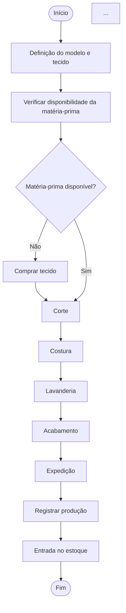

<!-- Alterar apenas o que tá em italico (o que está entre um único asteristico, ex: *batata doce com abobrinha*. -->

## 1. Caracterização da Organização
<!-- *(vale 7,5% — Dimensão Conceitual)* -->

- **Nome e natureza da organização:** *A organização escolhida para o desenvolvimento do projeto é a Namiê Brasil Ltda., empresa do segmento de moda feminina, com atuação na fabricação e comercialização de peças de vestuário, especialmente roupas jeans femininas. A empresa possui atuação tanto no comércio atacadista quanto no varejista. Informações públicas cadastrais classificam sua atividade principal como confecção de peças do vestuário, além de atividades de comércio atacadista e varejista de artigos do vestuário.*
  
- **Contexto e porte:** *A Namiê Brasil está localizada no bairro do Brás, em São Paulo – SP, e possui aproximadamente 50 pessoas envolvidas em suas operações. A organização possui diferentes setores, incluindo produção, costura, acabamento, expedição, pontos de venda, e-commerce, financeiro, recursos humanos e diretoria.

A empresa trabalha com fabricação própria de roupas femininas e comercializa seus produtos em diferentes canais. No atacado, as vendas ocorrem presencialmente nos pontos de venda e também por meio do WhatsApp, tendo como público principal as revendedoras. No varejo, as vendas são realizadas por meio do site e de marketplaces, atendendo diretamente consumidores finais.

O processo produtivo envolve a definição do modelo e do tecido, aquisição de matéria-prima quando necessária, corte, costura, lavanderia e acabamento. O acabamento compreende atividades como aplicação de botões, etiquetas, tags e demais aviamentos. Algumas etapas, como costura e acabamento, podem ser realizadas internamente ou por terceiros.*

- **Problemas e necessidades identificados:** *Durante o levantamento realizado com a organização, foi identificada uma fragmentação no controle das informações de estoque e vendas, que atualmente são distribuídas entre diferentes ferramentas.

O controle de matérias-primas, cortes, costura, acabamento e determinadas movimentações é realizado por meio do sistema Omiê. O controle dos estoques de produtos acabados, incluindo o estoque geral e o estoque destinado à feira, é realizado por meio de planilhas eletrônicas. Já as vendas realizadas pelo site e marketplaces são controladas pelo sistema Bling ERP, que também mantém o estoque destinado às vendas online.

Essa divisão faz com que as informações de estoque não estejam centralizadas em um único sistema. Além disso, as planilhas não são atualizadas necessariamente no momento em que ocorre uma movimentação, podendo ocorrer divergências entre o estoque registrado e a quantidade efetivamente disponível.

Também foi identificado que, em determinadas situações, uma peça pode ser vendida sem que sua disponibilidade seja previamente confirmada, ocasionando a venda de produtos que não estão disponíveis em estoque. Nas vendas realizadas na feira, a baixa das peças pode ocorrer imediatamente ou posteriormente, contribuindo para a possibilidade de divergências no controle.

Outro ponto identificado é a ausência de um estoque mínimo definido, fazendo com que a necessidade de produção ou reposição seja percebida principalmente quando a quantidade disponível se torna insuficiente ou se esgota.*

- **Justificativa da escolha:** *A Namiê Brasil foi escolhida por apresentar uma operação real que envolve diferentes processos relacionados à produção, controle de estoque e comercialização de produtos, proporcionando quantidade e variedade suficientes de informações para a realização da modelagem conceitual.

Além disso, um dos integrantes do grupo possui acesso à organização, permitindo o levantamento de requisitos diretamente com base nos processos reais observados. A existência de diferentes ferramentas utilizadas simultaneamente para controle das operações também proporciona um problema concreto para análise e modelagem de uma possível solução integrada.

O controle de produtos acabados apresenta ainda diferentes características que precisam ser consideradas pelo sistema, como modelo, coleção, cor, tamanho e SKU, além da existência de diferentes locais de estoque e canais de venda.*

- **Evidências da organização:** *Namiê Brasil possui presença pública na internet por meio de seu site oficial:*

https://www.namiebrasil.com.br/

*E pelo instagram:*

https://www.instagram.com/namiebrasil/

*A empresa está localizada no bairro do Brás, em São Paulo – SP. Informações públicas de cadastro empresarial indicam a sede na Rua Piratininga, 514, conjunto 500, Brás, São Paulo – SP, CEP 03042-000.
Porém, possui 3 lojas físicas.

As demais evidências referentes ao acesso do grupo à organização, como registros da pesquisa de campo, fotografias e identificação do responsável que forneceu as informações, serão anexadas ou apresentadas conforme a documentação disponível ao grupo.*
<!-- Falta pegar as fotos -->
---

## 2. Processos de Negócio
<!-- *(vale 10% — Dimensão Procedimental)* -->

- **Principais processos mapeados:**
*A produção inicia-se com a definição do modelo e do tecido pela diretoria. Após verificar a disponibilidade da matéria-prima, o tecido é adquirido quando necessário. Em seguida, o material passa pelas etapas de corte, costura, lavanderia e acabamento, todas realizadas pela própria fábrica. No acabamento são aplicados itens como botões, etiquetas, tags e demais aviamentos. Após a conclusão, as peças são encaminhadas à expedição, que registra a produção e realiza a entrada dos produtos acabados no estoque.*
  
*Após a conclusão da produção, os produtos acabados são encaminhados à expedição, que registra sua entrada no estoque. O estoque geral é utilizado como principal estoque de produtos acabados e pode abastecer o estoque destinado à feira. Quando necessário, ocorre uma transferência do estoque geral para o estoque da feira, atualmente realizada por meio de planilhas.
O estoque destinado às vendas online é controlado separadamente pelo Bling ERP. Dessa forma, os estoques geral, feira e online possuem controles distintos.
Peças que apresentam defeitos, são perdidas, utilizadas como amostras ou retornam da feira são destinadas ao “defeitão”, não sendo consideradas no estoque normal. Já devoluções de vendas online que retornam sem danos podem voltar ao estoque online por meio do processo automatizado do Bling.*

*As vendas no atacado são realizadas presencialmente nos pontos de venda, principalmente na Feira da Madrugada, ou de forma online por meio do WhatsApp. O público principal é composto por revendedoras e outros clientes que adquirem produtos para revenda, embora também possam ocorrer vendas para consumidores finais.
O cliente informa os produtos desejados, identificados principalmente por modelo, cor e tamanho. Após a definição dos produtos e quantidades, é aplicado o preço de atacado e o pedido é realizado.
Atualmente, os pedidos de atacado não possuem o mesmo nível de estruturação das vendas online. As informações são tratadas principalmente por meio do atendimento e dos controles internos da empresa.
Após a venda, os produtos são separados e o estoque correspondente é atualizado. Na feira, essa baixa pode ocorrer imediatamente ou posteriormente, o que pode contribuir para divergências entre o estoque registrado e o estoque físico.*

*As vendas no varejo são realizadas por meio do site da empresa e de marketplaces. Quando o cliente realiza uma compra, o pedido é registrado no Bling ERP, que também realiza o controle do estoque destinado às vendas online.
O produto é identificado de forma mais precisa por meio do SKU ou EAN-13. Após o registro do pedido, o produto disponível é separado para expedição e posteriormente enviado ao cliente.
O estoque online é controlado separadamente dos demais estoques. Em caso de devolução de uma peça sem danos, o produto pode retornar ao estoque online, com a entrada sendo realizada automaticamente pelo Bling.*

  
- **Fluxogramas:** *represente visualmente pelo menos os processos-chave (imagens anexadas). Deve ficar claro o fluxo de cada processo e como eles se integram entre si.*
### 2.Produção de peças

### 2.2 Abastecimento e movimentação de estoque

---

## 3. Requisitos do Sistema
*(esta seção e a Seção 4 "Regras de Negócio" DIVIDEM 7,5% na dimensão conceitual — juntas valem 7,5%, não 7,5% cada — + 4% exclusivos desta seção na organização/documentação)*

### 3.1 Requisitos Funcionais
*O que o sistema precisa FAZER (ex.: "o sistema deve permitir registrar uma venda").*

### 3.2 Requisitos Não Funcionais
*Características de qualidade (ex.: desempenho, segurança, usabilidade, disponibilidade).*

---

## 4. Regras de Negócio
*(esta seção DIVIDE com a Seção 3 "Requisitos do Sistema" os mesmos 7,5% da dimensão conceitual — juntas valem 7,5%, não 7,5% cada — + 4% exclusivos desta seção na documentação. "Regras de negócio" é o termo técnico usado em modelagem de dados para as regras de funcionamento de qualquer organização, com ou sem fins lucrativos)*

- **Regras operacionais:** *condições que a organização impõe (ex.: "um pedido só pode ser fechado se houver estoque disponível", "uma doação só pode ser registrada com identificação do doador", "um ritual só pode ser agendado se o espaço estiver disponível").*
- **Restrições organizacionais:** *limitações que afetam o modelo (ex.: políticas internas, prazos, exigências legais, normas religiosas ou estatutárias) — e por que elas importam.*

---

## 5. Dicionário de Dados Conceitual (Preliminar)
*(vale 10% — Dimensão Procedimental)*

Para cada entidade identificada, liste:

| Atributo | Descrição | Regra de negócio associada |
|----------|-----------|------------------------------|
| *nome do atributo* | *o que ele representa* | *se houver alguma regra (obrigatoriedade, valores possíveis, etc.)* |

*Mantenha o dicionário organizado e padronizado (mesmo formato de tabela para todas as entidades).*

**Atenção à privacidade:** se forem usados exemplos de valores para ilustrar os atributos, esses exemplos devem ser **fictícios** — não utilize dados reais de clientes, fiéis, beneficiários, doadores ou funcionários da organização (nomes, CPFs, contatos etc.), mesmo que tenham sido observados durante a pesquisa de campo. Os exemplos devem apenas ser **coerentes com as operações reais** observadas.

---

## 6. Modelagem Conceitual (Entidades, Atributos, Relacionamentos)
*(vale 7,5% na dimensão conceitual)*

- **Entidades reconhecidas:** *liste e justifique brevemente cada uma.*
- **Atributos e classificações:** *quais atributos pertencem a cada entidade.*
- **Relacionamentos pertinentes:** *como as entidades se conectam.*
- **Restrições e políticas organizacionais aplicadas ao modelo.**

---

## 7. Diagrama Entidade-Relacionamento (DER)
*(vale 20% — é o item de maior peso da entrega)*

- Anexe o DER (em imagem).
- O diagrama deve representar corretamente:
  - Entidades
  - Atributos
  - Relacionamentos
  - **Cardinalidades**
- O modelo deve ser **consistente** e já demonstrar potencial de **escalabilidade e integração** (pensando nas próximas etapas do projeto).

---

## 8. Justificativa Técnica
*(vale 7,5% — sozinho, é o subcritério de maior peso dentro da Dimensão Conceitual)*

*Explique e defenda as decisões de abstração e modelagem tomadas: por que essas entidades, esses atributos, esses relacionamentos e essas cardinalidades — e não outras alternativas possíveis?*

---

## 9. Uso de Inteligência Artificial
*(documentação obrigatória — não é opcional se o grupo usou IA em qualquer etapa: pesquisa, escrita, organização de ideias ou revisão de texto)*

Se o grupo usou alguma ferramenta de IA (ChatGPT, Claude, Gemini, Perplexity etc.) em qualquer parte do trabalho, registre **para cada uso relevante**:

| Item | O que registrar |
|------|------------------|
| **Ferramenta e etapa** | Qual IA foi usada e em qual parte do trabalho (ex.: pesquisa sobre o setor da organização, redação do README, organização dos requisitos, revisão ortográfica/gramatical). |
| **Motivação** | Por que o grupo recorreu à IA nesse ponto específico. |
| **Prompt(s) utilizados** | Texto exato (ou muito próximo) do que foi perguntado/pedido à IA. |
| **Resposta recebida** | Resumo ou trecho relevante da resposta da IA. |
| **Fontes consultadas e verificadas** | Se a IA citou fontes/dados, quais foram checadas pelo grupo e como (ex.: comparação com o que foi observado na visita de campo). |
| **Trechos rejeitados ou corrigidos** | O que da resposta da IA foi descartado, editado ou corrigido manualmente, e por quê. |
| **Justificativa da escolha final** | Por que o grupo manteve, adaptou ou rejeitou o que a IA sugeriu. |
| **Reflexão crítica** | Limites, vieses ou erros identificados no uso da IA nessa etapa (ex.: informação desatualizada, alucinação, generalização incorreta sobre o tipo de organização). |

*Se o grupo não usou nenhuma ferramenta de IA, declare isso explicitamente nesta seção.*

---

<!-- ## Critérios Atitudinais (20%)
**Estes critérios NÃO constam explicitamente como item de entrega no README.** Eles são avaliados por meio de **Avaliação 360º entre os integrantes do grupo** (cada membro avalia os colegas de equipe) e, no caso da Colaboração, também pela **colaboração equilibrada no histórico de commits** do repositório GitHub — não pela leitura do restante do repositório nem pela apresentação:

- **Participação (5%):** envolvimento nas discussões técnicas e nas decisões do grupo.
- **Comprometimento (5%):** cumprimento de prazos e responsabilidades assumidas.
- **Colaboração (5%):** respeito às contribuições dos colegas, cooperação na construção do projeto e colaboração equilibrada no histórico de commits do repositório GitHub.
- **Autonomia (5%):** busca independente de soluções e proposta de melhorias. --> 
